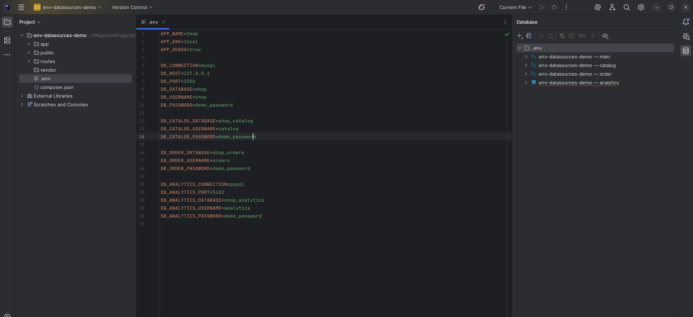

# Env Data Sources

Плагин для PhpStorm: при открытии проекта читает `.env` и заводит подключения в
**Database** — по одному на каждый набор ключей.

Демо (35 секунд): https://youtu.be/ztGDTMBs9IY



Для такого `.env`

```
DB_CONNECTION=mysql
DB_HOST=127.0.0.1
DB_PORT=3306
DB_DATABASE=texnomart
DB_USERNAME=root
DB_PASSWORD=secret

DB_CATALOG_DATABASE=catalog
DB_CATALOG_USERNAME=catalog_user
DB_CATALOG_PASSWORD=catalog_pass

DB_ORDER_DATABASE=orders
DB_ORDER_USERNAME=order_user
DB_ORDER_PASSWORD=order_pass
```

создаются три data source: `main`, `catalog`, `order`. Группам `CATALOG` и `ORDER`
не хватает host, port и драйвера — они наследуются от базового набора `DB_*`.

## Установка

`Settings → Plugins → Marketplace` → найдите **Env Data Sources** → `Install` → перезапустите IDE.

Пока версия не прошла ревью Marketplace, плагин ставится файлом:
`Settings → Plugins → ⚙ → Install Plugin from Disk…` и выбрать
`build/distributions/env-datasources-<версия>.zip` (собирается командой `./gradlew buildPlugin`).

Требуется PhpStorm 2025.3 или новее и плагин **Database Tools and SQL** — в PhpStorm
он встроен. В IntelliJ IDEA работает только в Ultimate; в Community базы данных
не поддерживаются.

После установки откройте проект с `.env` — подключения появятся в **Database**
в папке `.env`. Если ничего не появилось, дёрните вручную:
**Tools → Sync Data Sources from .env** — тогда будет уведомление даже при пустом
результате.

## Как работает разбор ключей

`DB_<GROUP>_<FIELD>` → группа `<GROUP>`, поле `<FIELD>`.
`DB_<FIELD>` → базовое подключение. Поля: `CONNECTION`/`DRIVER`, `HOST`, `PORT`,
`DATABASE`/`DB`, `USERNAME`/`USER`, `PASSWORD`/`PASS`, `URL`/`DSN`.

Поэтому `DB_CONNECTION` — это драйвер базового подключения, а не группа `CONNECTION`.
Группа попадает в результат, только если у неё есть своя `DATABASE` или `URL`;
имя группы может состоять из нескольких слов (`DB_ORDER_READ_DATABASE` → `ORDER_READ`).

Драйверы: `mysql`, `mariadb`, `pgsql`/`postgres`, `sqlite`, `sqlsrv`/`mssql`,
`oracle`, `clickhouse` (плюс алиасы Doctrine вида `pdo_mysql`).

## Что происходит с существующими подключениями

Каждый созданный data source помечается свойством `envDataSourcesId`
(`<путь к .env>#DB_CATALOG`). При повторной синхронизации плагин находит подключение
по этой метке и обновляет его, а не создаёт дубликат. Подключения, сделанные руками,
не трогаются. Если группа исчезла из `.env`, помеченный ею data source удаляется —
это отключается в настройках.

Пароли кладутся в хранилище паролей IDE (`Storage.PERSIST`), в `dataSources.xml` они не попадают.

## Настройки

`Settings → Tools → Env Data Sources`:

| Настройка | По умолчанию |
|---|---|
| `Enable in this project` | да |
| `Sync when the project opens` | да |
| `Sync when .env changes` | да (с задержкой 1,5 с) |
| `Store passwords in the IDE password safe` | да |
| `Remove data sources that disappeared from .env` | да |
| `Files` | `.env` (несколько — через `;`) |
| `Key prefixes` | `DB` |
| `Name template` | `{project} — {group}`, доступны `{group}`, `{database}`, `{env}`, `{project}` |
| `Folder in the Database tree` | `.env` |

Интерфейс плагина англоязычный — он публикуется в Marketplace на международную аудиторию.

Ручной запуск: **Tools → Sync Data Sources from .env**.

## Сборка

Нужен JDK 21 — подойдёт JBR из самого PhpStorm:

```bash
export JAVA_HOME=~/.local/share/JetBrains/Toolbox/apps/phpstorm/jbr
./gradlew buildPlugin
```

Готовый zip: `build/distributions/env-datasources-<версия>.zip`.

Личные пути держите в `local.properties` (не коммитится, пример —
`local.properties.example`). Полезны два ключа: `localIdePath` — собирать против
установленного PhpStorm вместо скачивания дистрибутива, и `org.gradle.java.home` —
если системная `java` старее 21. Без `localIdePath` Gradle скачает `platformVersion`
из `gradle.properties`.

Отладка в песочнице: `./gradlew runIde`.

## Публикация

Плагин раздаётся через [JetBrains Marketplace](https://plugins.jetbrains.com).
Порядок выпуска версии и настройка подписи — в [RELEASING.md](RELEASING.md).

## Тесты

```bash
./gradlew test
```

Юнит-тесты на разбор `.env` и группировку плюс интеграционные — они гоняют
`EnvDataSourceSync.apply` на настоящем `LocalDataSourceManager`: создание, обновление
без дублей, удаление устаревших, резолв драйвера.
